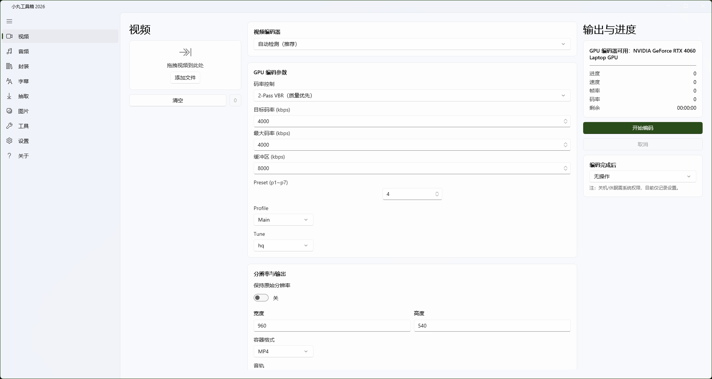
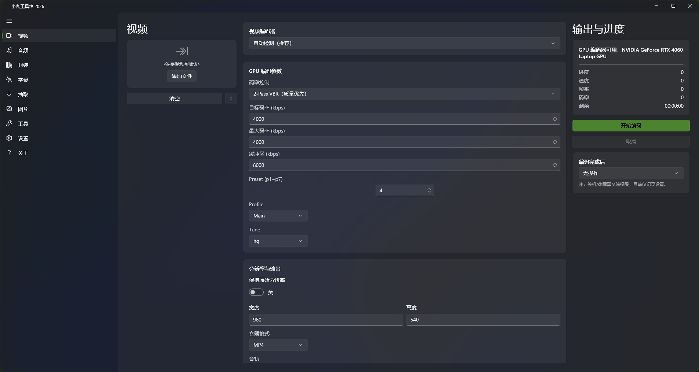
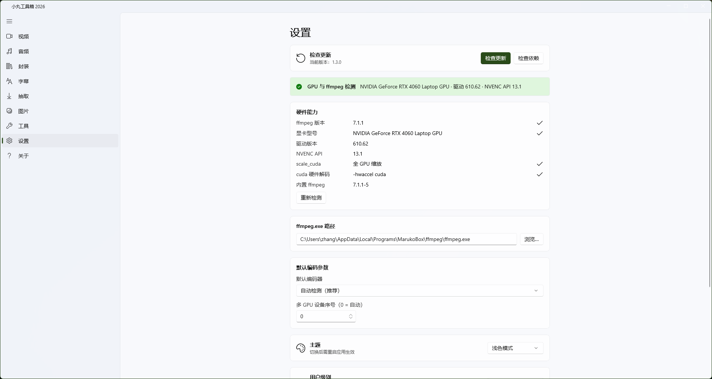
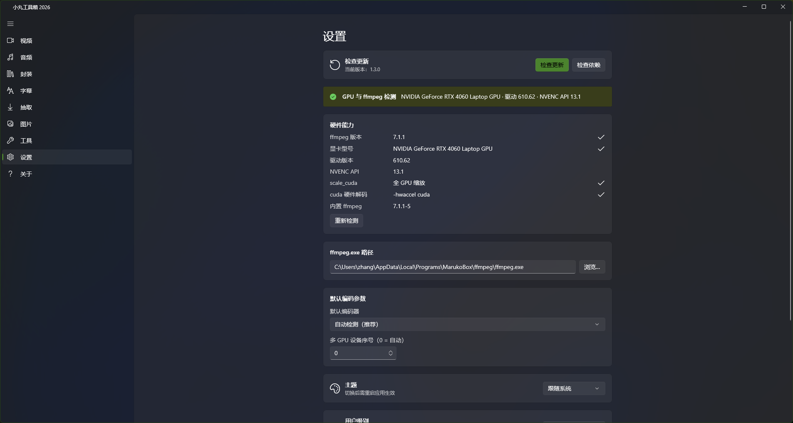

# MarukoBox 2026（小丸工具箱）

> 基于经典 [**小丸工具箱**](https://maruko.appinn.me/) 理念重做的现代化版本：保留「简单易用的压制工具箱」核心体验，用 WinUI 3 重构，并加入 GPU 硬件加速与内置 ffmpeg。

基于 [**ffmpeg**](https://ffmpeg.org/) 的 Windows 桌面多媒体处理工具箱，使用 **WinUI 3** + **.NET 10** 构建。

## 界面预览

| 浅色 | 深色 |
|---|---|
|  |  |
|  |  |

## 功能

- **视频**：转码、压制（可配合 GPU 硬件加速）
- **音频**：提取、转码、轨道处理
- **图片**：从视频抽帧、格式转换
- **字幕**：提取、嵌入、格式转换
- **封装 (Mux)**：音视频流重新封装
- **内置 ffmpeg**：安装包捆绑 [jellyfin-ffmpeg](https://github.com/jellyfin/jellyfin-ffmpeg) 便携版，开箱即用
- **检查更新 / 依赖**：软件自身从 GitHub 一键升级；可一键升级内置 ffmpeg（8.x 起带 NVENC API 13.1 门槛，驱动过旧自动拦截；专家级可强制安装任意版本）
- **主题**：跟随系统 / 浅色 / 深色
- **保持习惯**：退出时记住编码设置，下次自动恢复
- **用户分级**：普通 / 高级 / 专家，按级别显示不同复杂度选项（普通级为「低/中/高/非常高」恒定质量四档）

## 技术栈

| 项 | 说明 |
|---|---|
| UI | WinUI 3 (Windows App SDK) |
| 运行时 | .NET 10 (net10.0-windows) |
| 部署 | unpackaged，`WindowsPackageType=None`，自包含 |
| 安装器 | Inno Setup 6 |
| 核心引擎 | ffmpeg（内置捆绑 jellyfin-ffmpeg 便携版） |

## 仓库结构

```
maruko-box/
├── MarukoBox/          主程序源码 (WinUI3)
├── Installer-Inno/     Inno Setup 参数化脚本（一键构建）
├── Harness/            开发调试脚手架（服务层冒烟测试）
├── third_party/        [gitignore] 内置 ffmpeg 便携版 zip
└── dist/               [gitignore] 构建产物（安装包 exe）
```

> `dist/` 不入库（二进制大文件，走 GitHub Release 分发），可用下方脚本从源码重建。

## 构建安装包

需 Windows 10/11 (x64) + [.NET 10 SDK](https://dotnet.microsoft.com/download) + [Inno Setup 6](https://jrsoftware.org/isinfo.php)（`ISCC.exe`）+ PowerShell 7。

```powershell
# 把 jellyfin-ffmpeg*portable_win64.zip 放入 third_party/ 后一键构建
pwsh -File Installer-Inno\build-installer.ps1 -KeepPayload
# 产物：dist\MarukoBoxSetup-Inno_1.4.1.exe
```

流程：`dotnet publish`（自包含 unpackaged）→ 解压内置 ffmpeg 进 payload → `ISCC.exe` 编译生成安装包（中文向导、开始菜单快捷方式、卸载注册）。

## 安装与卸载

```text
MarukoBoxSetup-Inno_1.4.1.exe /VERYSILENT /SUPPRESSMSGBOXES /NORESTART   安装
unins000.exe /VERYSILENT /SUPPRESSMSGBOXES /NORESTART                     卸载
```

安装位置为当前用户目录（`%LOCALAPPDATA%\Programs\MarukoBox`），**无需 UAC**。

## 关于 ffmpeg 依赖

安装包默认**内置 jellyfin-ffmpeg 便携版**（解压至 `{app}\ffmpeg\`），按以下优先级解析生效路径：

1. **内置**：`{app}\ffmpeg\ffmpeg.exe`（默认，可经「设置 → 检查依赖」升级）
2. **手动配置**：设置页手动指定路径
3. **PATH**：系统环境变量中的 ffmpeg

## 许可证

主程序基于 [GPL-3.0 许可证](./LICENSE) 开源（强 copyleft）。安装包内置的 [jellyfin-ffmpeg](https://github.com/jellyfin/jellyfin-ffmpeg) 便携版同为 **GPL** 组件，详见 [THIRD-PARTY-NOTICES](./THIRD-PARTY-NOTICES.md)。
