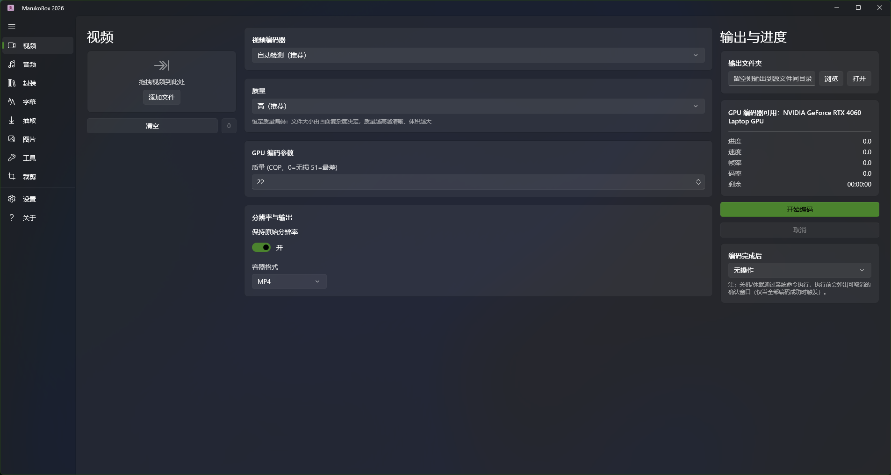
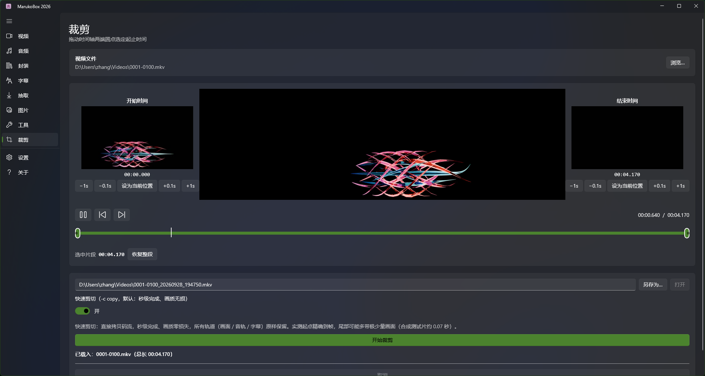
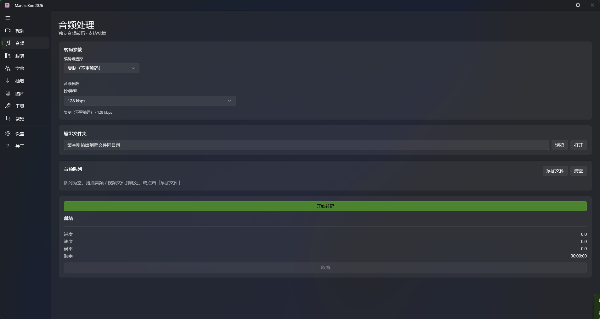
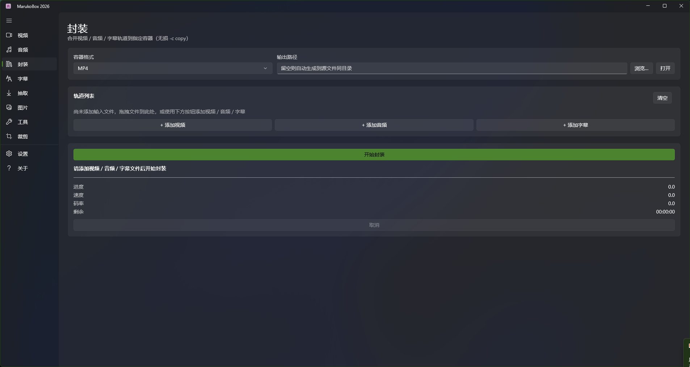
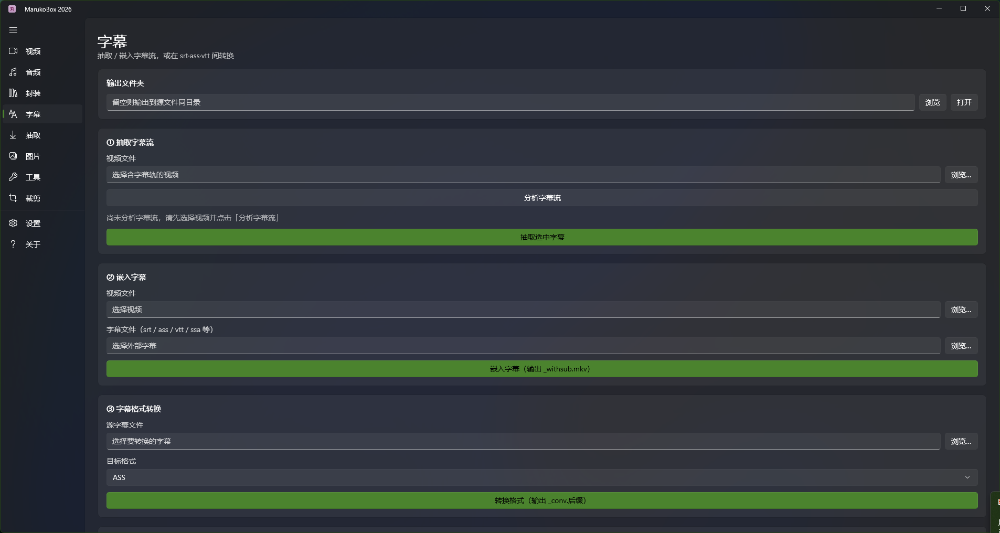
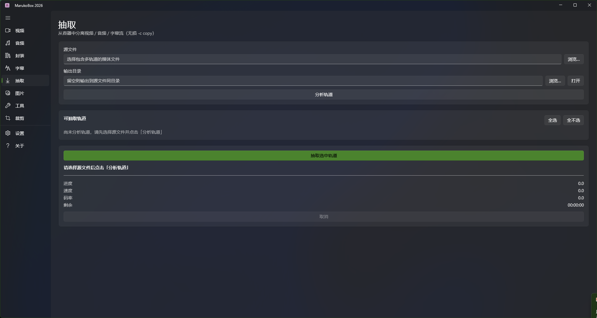
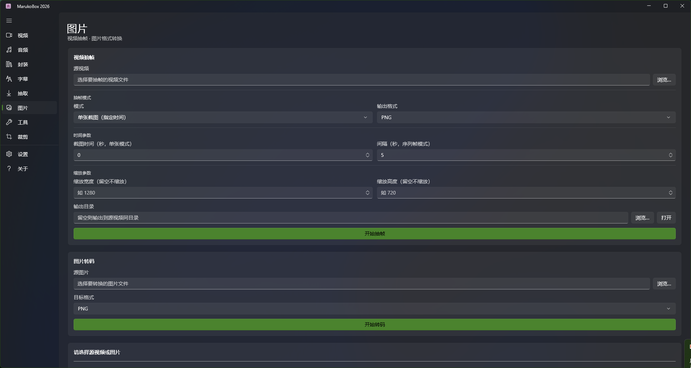
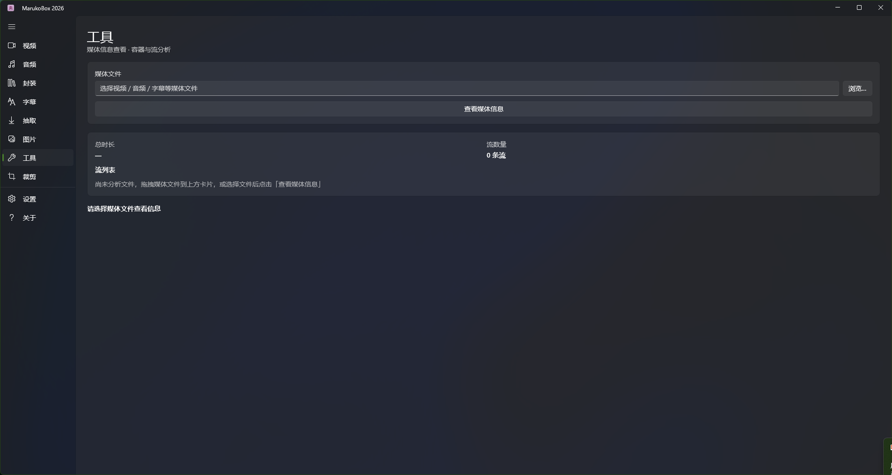
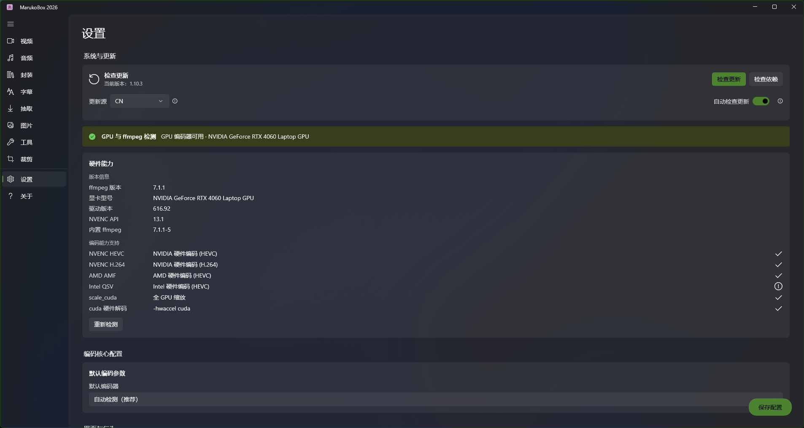
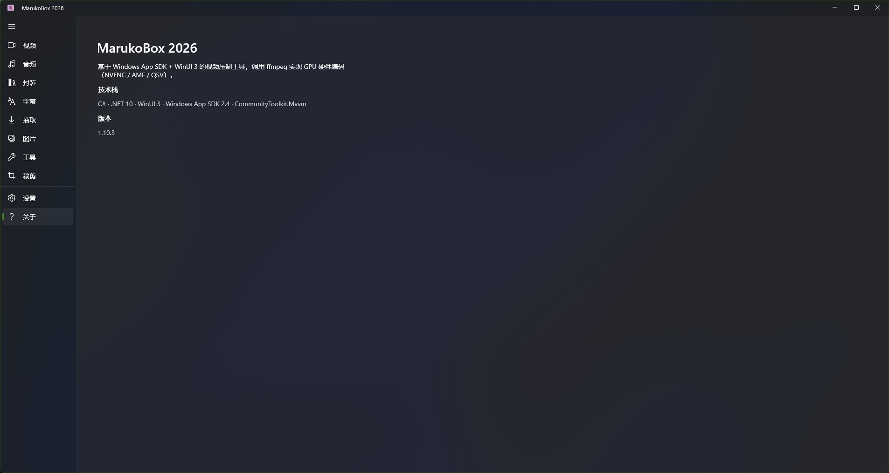

# MarukoBox 2026（小丸工具箱）

> 基于经典 [**小丸工具箱**](https://maruko.appinn.me/) 重做的现代化版本：保留「简单易用的压制工具箱」核心体验，用 WinUI 3 重构，并加入 GPU 硬件加速与内置 ffmpeg。

基于 [**ffmpeg**](https://ffmpeg.org/) 的 Windows 桌面多媒体处理工具箱，使用 **WinUI 3** + **.NET 10** 构建。

## 界面预览

| 视频 | 裁剪 |
| :---: | :---: |
|  |  |
| **音频** | **图片** |
|  |  |
| **字幕** | **抽帧** |
|  |  |
| **封装** | **工具** |
|  |  |
| **设置** | **关于** |
|  |  |

> 以上为全部 10 个页面的真实截图（v1.10.3，深色主题）。浅色主题效果见 `docs/screenshots/*-light.png`。

## 功能一览

| 模块               | 说明                                          |
| ---------------- | ------------------------------------------- |
| **视频**           | 转码 / 压制，支持 NVENC / AMF / QSV 硬件加速；批量队列，拖拽添加 |
| **裁剪**           | 可视化时间轴拖动两端选定起止，实时预览与抽帧                      |
| **音频**           | 独立音频转码（AAC / Opus / FLAC / MP3 等），支持批量      |
| **图片**           | 从视频抽帧、图片格式转换（含 WebP）                        |
| **字幕**           | 抽取 / 嵌入字幕流，或在 srt·ass·vtt 之间转换              |
| **封装 (Mux)**     | 合并视频 / 音频 / 字幕轨道到指定容器（无损 `-c copy`）         |
| **抽取 (Extract)** | 从容器中分离视频 / 音频 / 字幕流（无损 `-c copy`）           |
| **工具**           | 媒体信息查看（ffprobe）：容器与流分析                      |
| **设置**           | 主题、用户分级、检查更新、一键升级内置 ffmpeg                  |
| **关于**           | 版本与运行环境信息                                   |

- **内置 ffmpeg**：安装包捆绑 [jellyfin-ffmpeg](https://github.com/jellyfin/jellyfin-ffmpeg) 便携版，开箱即用；设置页可一键升级，升级时做驱动 / NVENC 能力校验（驱动过旧自动拦截，专家级可强制安装任意版本）。
- **主题**：跟随系统 / 浅色 / 深色。
- **用户分级**：普通 / 高级 / 专家，按级别显示不同复杂度选项（普通级为「低 / 中 / 高 / 非常高」恒定质量四档）。
- **习惯保持**：退出时记住编码设置，下次自动恢复。

## 技术栈

| 项    | 说明                                        |
| ---- | ----------------------------------------- |
| UI   | WinUI 3（Windows App SDK 2.4）              |
| 运行时  | .NET 10（`net10.0-windows10.0.26100.0`）    |
| 目标架构 | x86 / x64 / ARM64                         |
| 部署   | unpackaged（`WindowsPackageType=None`），自包含 |
| 安装器  | Inno Setup 6                              |
| 核心引擎 | ffmpeg（内置捆绑 jellyfin-ffmpeg 便携版）          |
| MVVM | CommunityToolkit.Mvvm 8.4.2               |

## 仓库结构

```text
maruko-box/
├── MarukoBox/          主程序源码 (WinUI 3)
├── Installer-Inno/     Inno Setup 脚本 + 构建脚本（一键构建安装包）
├── Harness/            开发调试脚手架（服务层冒烟测试）
├── third_party/        [gitignore] 内置 ffmpeg 便携版 zip
├── docs/               图标与界面截图
└── dist/               [gitignore] 构建产物（安装包 exe）
```

> `dist/`、`third_party/`、`payload/` 不入库（二进制大文件，走 GitHub Release 分发），可用下方脚本从源码重建。

## 构建安装包

需 Windows 10/11 + [.NET 10 SDK](https://dotnet.microsoft.com/download) + [Inno Setup 6](https://jrsoftware.org/isinfo.php)（`ISCC.exe`）+ PowerShell 7。

```powershell
# 把 jellyfin-ffmpeg*portable_win64.zip 放入 third_party/ 后一键构建
pwsh -File Installer-Inno\build-installer.ps1 -KeepPayload
# 产物：dist\MarukoBoxSetup-Inno_<版本>.exe（版本号随仓库 csproj / iss 同步变化）
```

流程：`dotnet publish`（自包含 unpackaged）→ 解压内置 ffmpeg 进 payload → `ISCC.exe` 编译生成安装包（中文向导、开始菜单快捷方式、卸载注册）。

## 安装与卸载

```text
MarukoBoxSetup-Inno_<版本>.exe /VERYSILENT /SUPPRESSMSGBOXES /NORESTART   安装
unins000.exe /VERYSILENT /SUPPRESSMSGBOXES /NORESTART                     卸载
```

安装位置为当前用户目录（`%LOCALAPPDATA%\Programs\MarukoBox`），**无需 UAC**。

## 关于 ffmpeg 依赖

安装包默认**内置 jellyfin-ffmpeg 便携版**（解压至 `{app}\ffmpeg\`），按以下优先级解析生效路径：

1. **内置**：`{app}\ffmpeg\ffmpeg.exe`（默认，可经「设置 → 检查依赖」升级）
2. **手动配置**：设置页手动指定路径
3. **PATH**：系统环境变量中的 ffmpeg

## 更新日志

各版本变更见 `Installer-Inno/release-notes-*.md`。

## 许可证

主程序基于 [GPL-3.0 许可证](./LICENSE) 开源（强 copyleft）。安装包内置的 [jellyfin-ffmpeg](https://github.com/jellyfin/jellyfin-ffmpeg) 便携版同为 **GPL** 组件，详见 [THIRD-PARTY-NOTICES](./THIRD-PARTY-NOTICES.md)。
